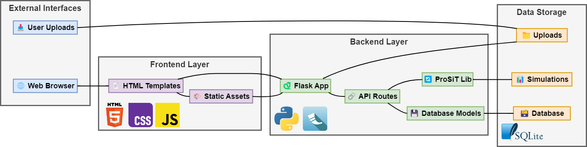

# ProSiT - Process Simulation Tool

ProSiT is a comprehensive process simulation tool that enables users to discover process models from event logs and simulate business processes with realistic parameters. The application provides a web-based interface for uploading XES event logs, discovering process models, and running simulations with configurable parameters.


## Features

- **Event Log Processing**: Upload and process XES event logs with support for various attributes
- **Process Discovery**: Automatic discovery of Petri nets from event logs using PM4Py
- **Parameter Discovery**: Intelligent discovery of simulation parameters including:
  - Control flow probabilities
  - Execution time distributions
  - Resource assignments and calendars
  - Arrival patterns and waiting times
- **Process Simulation**: Run discrete-event simulations with realistic parameters
- **Visualization**: Generate process models, performance metrics, and simulation results
- **Web Interface**: User-friendly web interface for all operations
- **Docker Support**: Easy deployment using Docker containers

## System Requirements

### Minimum Requirements
- **RAM**: 4GB (8GB recommended)
- **Storage**: 2GB free space
- **OS**: Windows 10/11, Ubuntu 18.04+, or macOS 10.14+

### For Docker Installation
- Docker Desktop (Windows/macOS) or Docker Engine (Linux)
- Docker Compose

## Quick Start

### Option 1: Docker Installation (Recommended)

#### Windows
1. Download and install [Docker Desktop](https://www.docker.com/products/docker-desktop/)
2. Run the setup script:
   ```cmd
   installer\windows\setup-windows.bat
   ```
3. Start the application:
   ```cmd
   installer\windows\run-docker.bat
   ```
4. Open your browser and go to `http://localhost:5000`

#### Ubuntu/Linux
1. Run the setup script:
   ```bash
   chmod +x installer/ubuntu/setup-ubuntu.sh
   ./installer/ubuntu/setup-ubuntu.sh
   ```
2. Log out and log back in (or restart)
3. Start the application:
   ```bash
   ./installer/ubuntu/run-docker.sh
   ```
4. Open your browser and go to `http://localhost:5000`

#### Manual Docker Setup
1. Clone the repository:
   ```bash
   git clone <repository-url>
   cd prosit
   ```

2. Build and run with Docker Compose:
   ```bash
   docker-compose up -d --build
   ```

3. Access the application at `http://localhost:5000`

### Option 2: Local Installation

#### Prerequisites
- Python 3.10+
- Conda or Miniconda

#### Setup Steps
1. Clone the repository:
   ```bash
   git clone <repository-url>
   cd prosit
   ```

2. Create the conda environment:
   ```bash
   conda env create -f environment.yml
   conda activate prosit
   ```

3. Install the application:
   ```bash
   pip install -e .
   ```

4. Run the application:
   ```bash
   python main.py
   ```

5. Access the application at `http://localhost:5000`

## Usage

### 1. Upload Event Log
- Navigate to the web interface
- Click "Choose File" and select your XES event log
- The XES file must contain the following required attributes:
  - `case:concept:name` (case identifier)
  - `concept:name` (activity name)
  - `start:timestamp` (activity start time)
  - `time:timestamp` (activity end time)
  - `org:resource` (resource identifier)

### 2. Choose Process Model Source
- **Discover from Log**: Automatically discover a Petri net from the event log
- **Upload Model**: Upload your own Petri net model

### 3. Configure Simulation Parameters
- Set simulation duration
- Configure number of cases to simulate
- Adjust discovery parameters for:
  - Control flow discovery
  - Time discovery
  - Resource discovery
  - Calendar discovery

### 4. Run Simulation
- Click "Start Simulation" to begin the process
- Monitor progress in real-time
- View results and download simulation outputs

## Project Structure

```
prosit/
├── app.py                 # Flask application configuration
├── main.py               # Application entry point
├── models.py             # Database models
├── routes.py             # Web routes and API endpoints
├── prosit_integration.py  # Core ProSiT integration
├── prosit/               # Core ProSiT library
│   ├── discovery/        # Parameter discovery modules
│   ├── simulator.py      # Simulation engine
│   └── utils/           # Utility functions
├── templates/           # HTML templates
├── static/              # CSS and JavaScript files
├── installer/           # Platform-specific setup scripts
├── example_data/        # Sample XES files
├── docker-compose.yml   # Docker Compose configuration
├── Dockerfile          # Docker image definition
└── environment.yml     # Conda environment specification
```

## System Architecture Diagram



## API Endpoints

- `GET /` - Main application interface
- `POST /upload` - Upload XES event log
- `POST /discover` - Discover process model
- `POST /simulate` - Run simulation
- `GET /results/<session_id>` - Get simulation results
- `GET /download/<session_id>/<file_type>` - Download result files

## Configuration

### Environment Variables
- `FLASK_ENV`: Set to `production` for production deployment
- `DATABASE_URL`: Database connection string (default: SQLite)
- `SESSION_SECRET`: Secret key for session management
- `MAX_CONTENT_LENGTH`: Maximum file upload size (default: 100MB)

### Database
The application uses SQLite by default, but can be configured to use other databases by setting the `DATABASE_URL` environment variable.

## Troubleshooting

### Common Issues

1. **Docker not starting**
   - Ensure Docker Desktop is running
   - Check system requirements
   - Verify virtualization is enabled in BIOS

2. **Port 5000 already in use**
   - Stop other services using port 5000
   - Modify `docker-compose.yml` to use a different port

3. **Memory issues during simulation**
   - Increase Docker memory allocation
   - Reduce simulation parameters (fewer cases, shorter duration)

4. **File upload errors**
   - Check file size (max 100MB)
   - Ensure XES file format is correct
   - Verify required attributes are present

### Logs and Debugging

- View application logs: `docker-compose logs -f`
- Check container status: `docker-compose ps`
- Restart application: `docker-compose restart`

## Development

### Setting up Development Environment
1. Clone the repository
2. Create conda environment: `conda env create -f environment.yml`
3. Activate environment: `conda activate prosit`
4. Install in development mode: `pip install -e .`
5. Run with debug mode: `FLASK_ENV=development python main.py`

### Contributing
1. Fork the repository
2. Create a feature branch
3. Make your changes
4. Add tests if applicable
5. Submit a pull request

## License

This project is licensed under the MIT License - see the LICENSE file for details.

## Support

For issues and questions:
1. Check the troubleshooting section above
2. Review the application logs
3. Create an issue in the repository
4. Contact the development team

## Acknowledgments

- Built with [PM4Py](https://pm4py.fit.fraunhofer.de/) for process mining
- Uses [Flask](https://flask.palletsprojects.com/) for the web framework
- Containerized with [Docker](https://www.docker.com/)
- Process visualization powered by [Graphviz](https://graphviz.org/)
